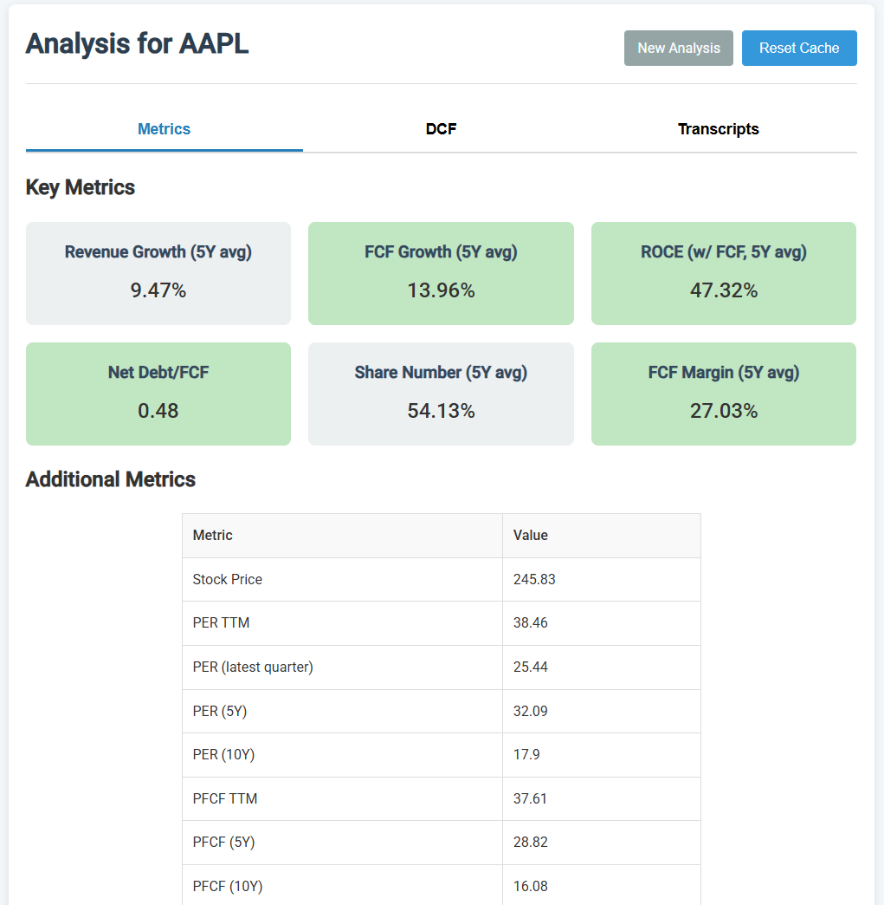
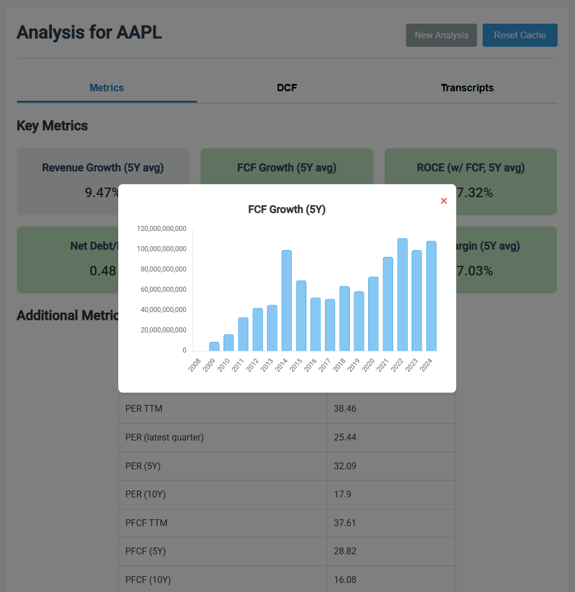
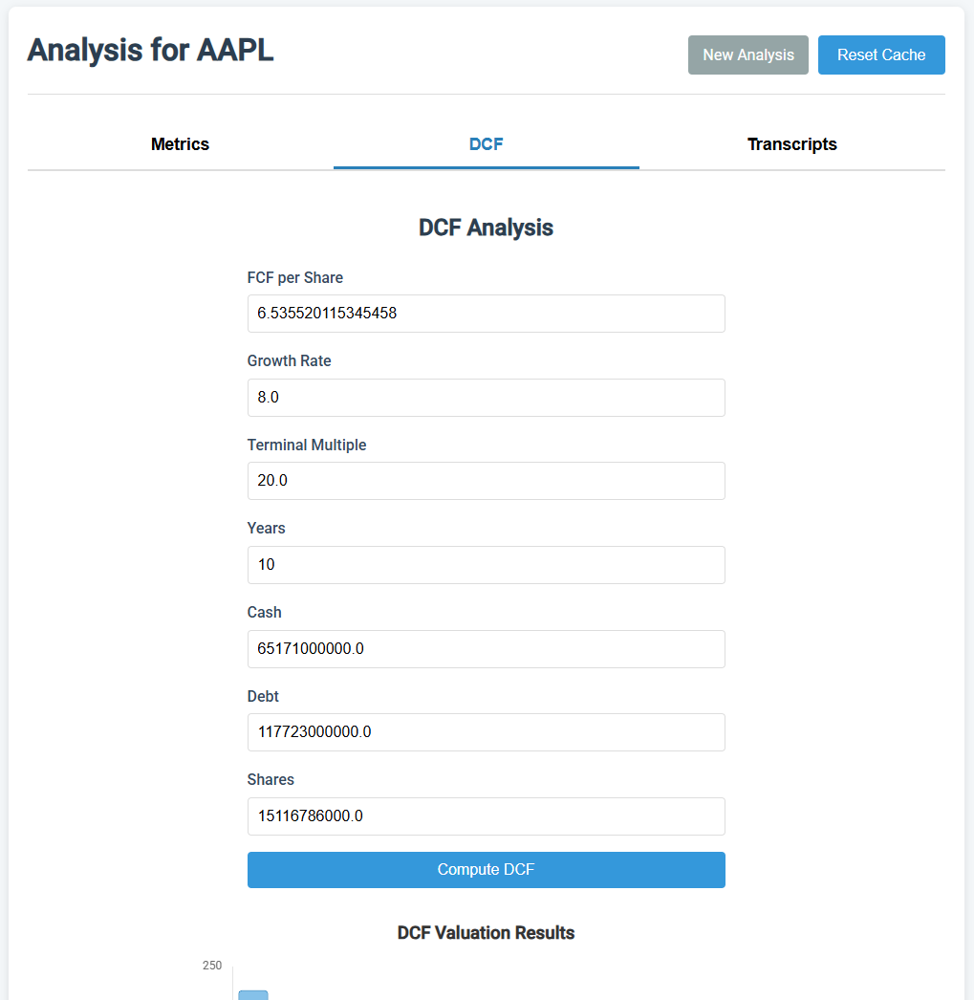
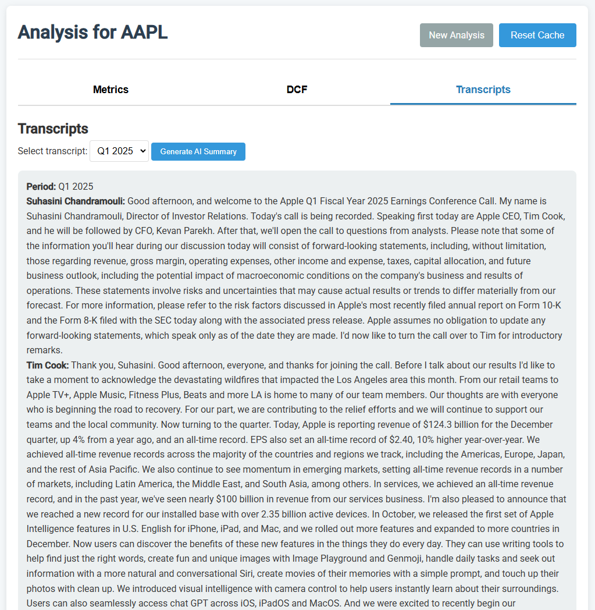

# Stock Analyzer

Stock Analyzer is a Flask application that orchestrates a set of parameterised Jupyter notebooks for fundamental equity research. Each notebook fetches raw fundamentals, runs calculations, and writes JSON artefacts that power the web dashboard.

## Features
- Derives growth, profitability, leverage, and valuation KPIs directly from Alpha Vantage fundamentals and yfinance price history.
- Executes a configurable DCF projection and renders intrinsic values for a range of discount rates.
- Downloads and caches full earnings call transcripts from API Ninjas for offline reuse.
- Produces AI-generated transcript summaries through Anthropic's Claude via LangChain.
- Stores all intermediate JSON on disk so subsequent runs reuse cached data.
 
## Tech Stack
- Python 3.11+ managed with `uv`.
- Flask + Jinja templates with vanilla JS/Chart.js frontend widgets.
- Papermill driving the notebooks (`analyze_stock.ipynb`, `dcf.ipynb`, `transcripts.ipynb`, `transcript_summary.ipynb`).
- Pandas, Requests, yfinance, python-dotenv, langchain-anthropic.

## Project Layout
- `app.py` - Flask entry point that executes notebooks and serves templates.
- `analyze_stock.ipynb` - fetches Alpha Vantage reports, joins them, and computes metrics stored in `analysis/<ticker>.json`.
- `dcf.ipynb` - DCF notebook consuming UI parameters and writing `dcf/<ticker>.json`.
- `transcripts.ipynb` - downloads transcripts into `transcripts/`.
- `transcript_summary.ipynb` - generates Claude summaries into `summaries/`.
- `static/`, `templates/` - frontend assets.
- Runtime caches: `analysis/`, `dcf/`, `data/`, `summaries/`, `transcripts/` (gitignored and created on demand).

## Prerequisites
- Python 3.11 or newer (Python 3.12 works as well; `uv` can install and manage versions).
- [uv](https://github.com/astral-sh/uv).
- Access keys stored in `.env`:
  - `VANTAGE_API_KEY` - Alpha Vantage.
  - `API_NINJA_API_KEY` - API Ninjas earnings call transcript API.
  - `ANTHROPIC_API_KEY` - Anthropic Claude (optional, required for summaries).

Copy the sample env file and populate the variables:

```bash
cp .env.example .env
```

The notebooks raise a descriptive error if a required key is missing. Leave `ANTHROPIC_API_KEY` blank to skip summarisation.

## Install `uv`
- macOS / Linux
```bash
curl -LsSf https://astral.sh/uv/install.sh | sh
```
- Windows (PowerShell)
```powershell
irm https://astral.sh/uv/install.ps1 | iex
```

Confirm the installation with `uv --version`.

## Set Up with `uv`
1. Clone the repository.
```bash
git clone <repo-url>
cd stock-analyzer
```
2. Create a virtual environment.
```bash
uv venv
```
This creates `.venv/` in the project root. Activate it if you prefer working inside an activated shell:
- macOS / Linux: `source .venv/bin/activate`
- Windows PowerShell: `./.venv/Scripts/Activate.ps1`

You can also skip manual activation and prefix commands with `uv run`.

3. Initialise dependency metadata (run once):
```bash
uv init --package
```
This creates `pyproject.toml` with your interpreter constraint. If the file already exists, skip this step.

4. Add runtime dependencies (updates `pyproject.toml` and `uv.lock`):
```bash
uv add flask papermill python-dotenv pandas requests yfinance langchain-anthropic
```
Add developer tools as needed:
```bash
uv add --dev jupyter
```
 
5. Install the locked environment (creates `.venv/` if it does not exist):
```bash
uv sync
```
Commit `pyproject.toml` and `uv.lock` so teammates can reproduce the environment with a single `uv sync`.

6. Ensure `.env` contains your API keys before starting the app.
The first execution will download data and create the runtime folders. Cached JSON files reduce API calls on subsequent runs.

## Running the App
Start Flask with the reloader enabled:
```bash
uv run flask --app app run --debug
```
Visit http://127.0.0.1:5000/ and submit a ticker. The app concurrently runs `analyze_stock.ipynb` and `transcripts.ipynb`, then renders metrics, DCF inputs, and transcript data. Use the DCF form to run `dcf.ipynb` with custom assumptions. The "Reset cache" button deletes cached Alpha Vantage JSON and re-runs the notebooks.

To run without the Flask CLI:
```bash
uv run python app.py
```

## Notebook Automation
Run notebooks directly through Papermill while reusing the same environment:
```bash
uv run papermill analyze_stock.ipynb /tmp/out.ipynb -p ticker AAPL
uv run papermill dcf.ipynb /tmp/dcf.ipynb -p ticker AAPL -p fcf_ps 3.5 -p growth_rate 0.08 -p terminal_multiple 18 -p years 10 -p cash 1200000000 -p debt 400000000 -p shares 450000000
```
`transcripts.ipynb` expects a `ticker_list` parameter (list of tickers), and `transcript_summary.ipynb` expects `ticker`, `year`, and `quarter`. Results are written to the cached folders listed above.

## Troubleshooting
- **Alpha Vantage limits** - if the API returns a rate-limit message the notebook raises `APIRateLimitError`; wait 60 seconds or upgrade the key.
- **Missing Anthropic key** - the summary endpoint will respond with an error; supply the key or ignore the summaries tab.
- **Papermill failures** - the Flask console logs the failing notebook cell. Re-run the notebook manually with `uv run papermill ...` to iterate faster.
- **Windows WSL mount warnings** - run the project from PowerShell if shared drives are not mounted in WSL.

## Interface









## APIs Used
- Alpha Vantage
- Yahoo Finance
- API Ninjas
- Anthropic
